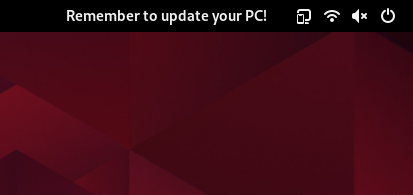
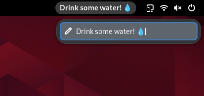

# Panel Note

Add a small note to your GNOME panel. 

> [!NOTE]
> This extension is inspired by the macOS app "One Thing."

## Usage

When you enable the extension, the default note will appear on your panel. To edit the note, simply click on the note and type in your new note.